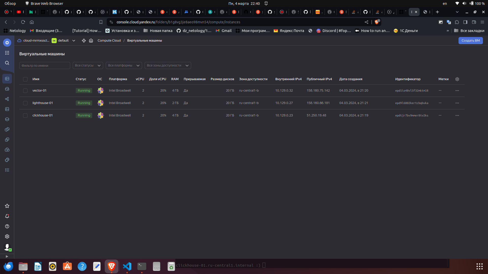
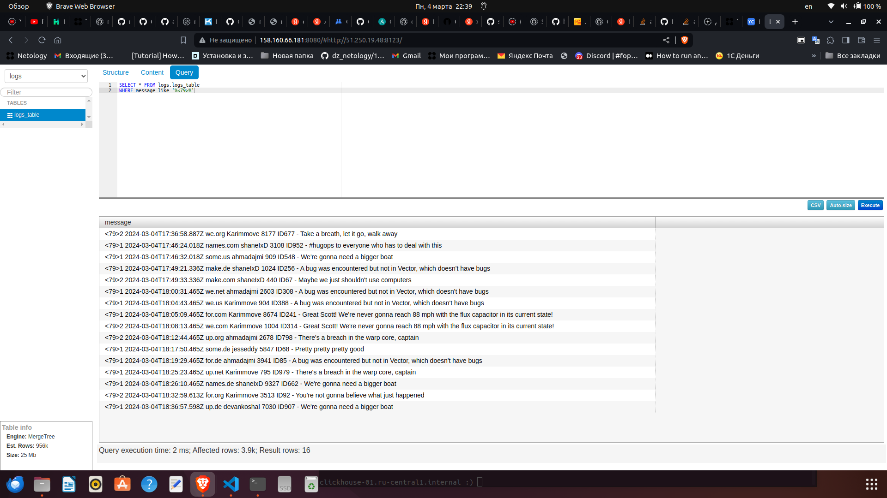
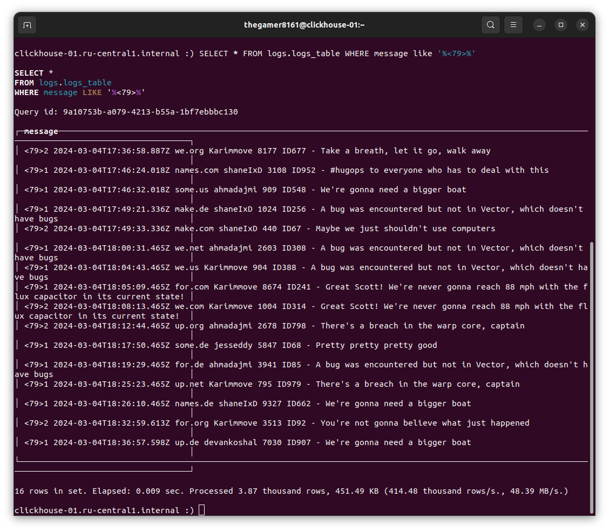

# Никоноров Денис - FOPS-8
# Домашнее задание к занятию «Использование Ansible»

## Основная часть

1. Допишите playbook: нужно сделать еще один play, который устанавливает и настраивает LightHouse.

2. При создании task рекомендую использовать модули: `get_url`,`template`,`yum`,`apt`.

3. Tasks должны: скачать статику LightHouse, установить Nginx или любой другой веб-сервер, настроить его конфиг для окрытия LightHouse, запустить веб-сервер.

В файле [site.yml](playbook/site.yml) добавлен PLAY с тэгом `tags=lighthouse`, который устанавливает и настраивает lighthouse.

4. Подготовьте свой inventory-файл `prod.yml`.

[prod.yml](playbook/inventory/prod.yml) подготовленный файл `prod.yml`.

5. Запуститие `ansible-lint site.yml` и исправьте ошибки, если они есть.

<details>
	<summary>ansible-lint site.yml</summary>
```
thegamer8161@thegamer8161:~/ansible/03-yandex/playbook$ ansible-lint site.yml
Failed to guess project directory using git: fatal: не найден git репозиторий (или один из родительских каталогов): .git
WARNING  Overriding detected file kind 'yaml' with 'playbook' for given positional argument: site.yml
an AnsibleCollectionFinder has not been installed in this process
```
</details>

6. Попробуйте запустить playbook на этом окружении с флагом `--check`.

<details>
	<summary>ansible-playbook -i inventory/prod.yml site.yml --check</summary>
```
thegamer8161@thegamer8161:~/ansible/03-yandex/playbook$ ansible-playbook -i inventory/prod.yml site.yml --check

PLAY [Install Clickhouse] ***************************************************************************************************************************************

TASK [Get clickhouse distrib] ***********************************************************************************************************************************
The authenticity of host '51.250.19.48 (51.250.19.48)' can't be established.
ED25519 key fingerprint is SHA256:4CACZHCzo06EL71mSKMptFR9qU+Aq+DLUCVJ3JZ7cXY.
This key is not known by any other names
Are you sure you want to continue connecting (yes/no/[fingerprint])? yes
changed: [clickhouse-01] => (item=clickhouse-client)
changed: [clickhouse-01] => (item=clickhouse-server)
failed: [clickhouse-01] (item=clickhouse-common-static) => {"ansible_loop_var": "item", "changed": false, "dest": "./clickhouse-common-static-22.3.3.44.rpm", "elapsed": 0, "item": "clickhouse-common-static", "msg": "Request failed", "response": "HTTP Error 404: Not Found", "status_code": 404, "url": "https://packages.clickhouse.com/rpm/stable/clickhouse-common-static-22.3.3.44.noarch.rpm"}

TASK [Get clickhouse distrib] ***********************************************************************************************************************************
changed: [clickhouse-01] => (item=clickhouse-client)
changed: [clickhouse-01] => (item=clickhouse-server)
changed: [clickhouse-01] => (item=clickhouse-common-static)

TASK [Install clickhouse packages] ******************************************************************************************************************************
fatal: [clickhouse-01]: FAILED! => {"ansible_facts": {"pkg_mgr": "yum"}, "changed": false, "msg": "No RPM file matching 'clickhouse-common-static-22.3.3.44.rpm' found on system", "rc": 127, "results": ["No RPM file matching 'clickhouse-common-static-22.3.3.44.rpm' found on system"]}

PLAY RECAP ******************************************************************************************************************************************************
clickhouse-01              : ok=1    changed=1    unreachable=0    failed=1    skipped=0    rescued=1    ignored=0 ```
</details>

7. Запустите playbook на `prod.yml` окружение с флагом `--diff`. Убедитесь, что изменения на системе произведены.

<details>
	<summary>ansible-playbook -i inventory/prod.yml site.yml --diff</summary>
```
thegamer8161@thegamer8161:~/ansible/03-yandex/playbook$ ansible-playbook -i inventory/prod.yml site.yml --diff

PLAY [Install Clickhouse] ***************************************************************************************************************************************

TASK [Get clickhouse distrib] ***********************************************************************************************************************************
ok: [clickhouse-01] => (item=clickhouse-client)
ok: [clickhouse-01] => (item=clickhouse-server)
failed: [clickhouse-01] (item=clickhouse-common-static) => {"ansible_loop_var": "item", "changed": false, "dest": "./clickhouse-common-static-22.3.3.44.rpm", "elapsed": 0, "gid": 1000, "group": "thegamer8161", "item": "clickhouse-common-static", "mode": "0644", "msg": "Request failed", "owner": "thegamer8161", "response": "HTTP Error 404: Not Found", "secontext": "unconfined_u:object_r:user_home_t:s0", "size": 246310036, "state": "file", "status_code": 404, "uid": 1000, "url": "https://packages.clickhouse.com/rpm/stable/clickhouse-common-static-22.3.3.44.noarch.rpm"}

TASK [Get clickhouse distrib] ***********************************************************************************************************************************
ok: [clickhouse-01] => (item=clickhouse-client)
ok: [clickhouse-01] => (item=clickhouse-server)
ok: [clickhouse-01] => (item=clickhouse-common-static)

TASK [Install clickhouse packages] ******************************************************************************************************************************
ok: [clickhouse-01]

TASK [Modify Clickhouse config.xml] *****************************************************************************************************************************
ok: [clickhouse-01]

TASK [Flush handlers] *******************************************************************************************************************************************

TASK [Wait for clickhouse-server to become available] ***********************************************************************************************************
Pausing for 30 seconds (output is hidden)
(ctrl+C then 'C' = continue early, ctrl+C then 'A' = abort)
Press 'C' to continue the play or 'A' to abort 
ok: [clickhouse-01]

TASK [Create database] ******************************************************************************************************************************************
ok: [clickhouse-01]

TASK [Create Clickhouse table] **********************************************************************************************************************************
ok: [clickhouse-01]

PLAY [Vector] ***************************************************************************************************************************************************

TASK [Create vector work directory] *****************************************************************************************************************************
ok: [vector-01]

TASK [Get Vector distrib] ***************************************************************************************************************************************
ok: [vector-01]

TASK [Unzip Vector archive] *************************************************************************************************************************************
ok: [vector-01]

TASK [Install Vector binary] ************************************************************************************************************************************
ok: [vector-01]

TASK [Check Vector installation] ********************************************************************************************************************************
changed: [vector-01]

TASK [Create Vector etc directory] ******************************************************************************************************************************
ok: [vector-01]

TASK [Create Vector config vector.yaml] *************************************************************************************************************************
ok: [vector-01]

TASK [Create vector.service daemon] *****************************************************************************************************************************
changed: [vector-01]

TASK [Modify Vector.service file ExecStart] *********************************************************************************************************************
--- before: /lib/systemd/system/vector.service
+++ after: /lib/systemd/system/vector.service
@@ -7,7 +7,7 @@
 [Service]
 User=vector
 Group=vector
-ExecStartPre=/usr/bin/vector validate
+ExecStartPre=/usr/bin/vector validate --config-yaml /etc/vector/vector.yaml
 ExecStart=/usr/bin/vector
 ExecReload=/usr/bin/vector validate
 ExecReload=/bin/kill -HUP $MAINPID

changed: [vector-01]

TASK [Modify Vector.service file ExecStartPre] ******************************************************************************************************************
--- before: /lib/systemd/system/vector.service
+++ after: /lib/systemd/system/vector.service
@@ -8,7 +8,7 @@
 User=vector
 Group=vector
 ExecStartPre=/usr/bin/vector validate --config-yaml /etc/vector/vector.yaml
-ExecStart=/usr/bin/vector
+ExecStart=/usr/bin/vector --config-yaml /etc/vector/vector.yaml
 ExecReload=/usr/bin/vector validate
 ExecReload=/bin/kill -HUP $MAINPID
 Restart=no

changed: [vector-01]

TASK [Create user vector] ***************************************************************************************************************************************
ok: [vector-01]

TASK [Create Vector data_dir] ***********************************************************************************************************************************
ok: [vector-01]

RUNNING HANDLER [Start Vector service] **************************************************************************************************************************
changed: [vector-01]

PLAY [Lighthouse] ***********************************************************************************************************************************************

TASK [Pre-install Nginx & Git client] ***************************************************************************************************************************
fatal: [lighthouse-01]: FAILED! => {"ansible_facts": {"discovered_interpreter_python": "/usr/bin/python"}, "changed": false, "msg": "No package matching 'nginx' found available, installed or updated", "rc": 126, "results": ["No package matching 'nginx' found available, installed or updated"]}

PLAY RECAP ******************************************************************************************************************************************************
clickhouse-01              : ok=6    changed=0    unreachable=0    failed=0    skipped=0    rescued=1    ignored=0   
lighthouse-01              : ok=0    changed=0    unreachable=0    failed=1    skipped=0    rescued=0    ignored=0   
vector-01                  : ok=13   changed=5    unreachable=0    failed=0    skipped=0    rescued=0    ignored=0```
</details>

8. Повторно запустите playbook с флагом `--diff` и убедитесь, что playbook индепотентен.

<details>
	<summary>ansible-playbook -i inventory/prod.yml site.yml --diff</summary>
```
thegamer8161@thegamer8161:~/ansible/03-yandex/playbook$ ansible-playbook -i inventory/prod.yml site.yml --diff

PLAY [Install Clickhouse] ***************************************************************************************************************************************

TASK [Get clickhouse distrib] ***********************************************************************************************************************************
ok: [clickhouse-01] => (item=clickhouse-client)
ok: [clickhouse-01] => (item=clickhouse-server)
failed: [clickhouse-01] (item=clickhouse-common-static) => {"ansible_loop_var": "item", "changed": false, "dest": "./clickhouse-common-static-22.3.3.44.rpm", "elapsed": 0, "gid": 1000, "group": "thegamer8161", "item": "clickhouse-common-static", "mode": "0644", "msg": "Request failed", "owner": "thegamer8161", "response": "HTTP Error 404: Not Found", "secontext": "unconfined_u:object_r:user_home_t:s0", "size": 246310036, "state": "file", "status_code": 404, "uid": 1000, "url": "https://packages.clickhouse.com/rpm/stable/clickhouse-common-static-22.3.3.44.noarch.rpm"}

TASK [Get clickhouse distrib] ***********************************************************************************************************************************
ok: [clickhouse-01] => (item=clickhouse-client)
ok: [clickhouse-01] => (item=clickhouse-server)
ok: [clickhouse-01] => (item=clickhouse-common-static)

TASK [Install clickhouse packages] ******************************************************************************************************************************
ok: [clickhouse-01]

TASK [Modify Clickhouse config.xml] *****************************************************************************************************************************
ok: [clickhouse-01]

TASK [Flush handlers] *******************************************************************************************************************************************

TASK [Wait for clickhouse-server to become available] ***********************************************************************************************************
Pausing for 30 seconds (output is hidden)
(ctrl+C then 'C' = continue early, ctrl+C then 'A' = abort)
Press 'C' to continue the play or 'A' to abort 
ok: [clickhouse-01]

TASK [Create database] ******************************************************************************************************************************************
ok: [clickhouse-01]

TASK [Create Clickhouse table] **********************************************************************************************************************************
ok: [clickhouse-01]

PLAY [Vector] ***************************************************************************************************************************************************

TASK [Create vector work directory] *****************************************************************************************************************************
ok: [vector-01]

TASK [Get Vector distrib] ***************************************************************************************************************************************
ok: [vector-01]

TASK [Unzip Vector archive] *************************************************************************************************************************************
ok: [vector-01]

TASK [Install Vector binary] ************************************************************************************************************************************
ok: [vector-01]

TASK [Check Vector installation] ********************************************************************************************************************************
changed: [vector-01]

TASK [Create Vector etc directory] ******************************************************************************************************************************
ok: [vector-01]

TASK [Create Vector config vector.yaml] *************************************************************************************************************************
ok: [vector-01]

TASK [Create vector.service daemon] *****************************************************************************************************************************
changed: [vector-01]

TASK [Modify Vector.service file ExecStart] *********************************************************************************************************************
--- before: /lib/systemd/system/vector.service
+++ after: /lib/systemd/system/vector.service
@@ -7,7 +7,7 @@
 [Service]
 User=vector
 Group=vector
-ExecStartPre=/usr/bin/vector validate
+ExecStartPre=/usr/bin/vector validate --config-yaml /etc/vector/vector.yaml
 ExecStart=/usr/bin/vector
 ExecReload=/usr/bin/vector validate
 ExecReload=/bin/kill -HUP $MAINPID

changed: [vector-01]

TASK [Modify Vector.service file ExecStartPre] ******************************************************************************************************************
--- before: /lib/systemd/system/vector.service
+++ after: /lib/systemd/system/vector.service
@@ -8,7 +8,7 @@
 User=vector
 Group=vector
 ExecStartPre=/usr/bin/vector validate --config-yaml /etc/vector/vector.yaml
-ExecStart=/usr/bin/vector
+ExecStart=/usr/bin/vector --config-yaml /etc/vector/vector.yaml
 ExecReload=/usr/bin/vector validate
 ExecReload=/bin/kill -HUP $MAINPID
 Restart=no

changed: [vector-01]

TASK [Create user vector] ***************************************************************************************************************************************
ok: [vector-01]

TASK [Create Vector data_dir] ***********************************************************************************************************************************
ok: [vector-01]

RUNNING HANDLER [Start Vector service] **************************************************************************************************************************
changed: [vector-01]

PLAY [Lighthouse] ***********************************************************************************************************************************************

TASK [install EPEL repo] ****************************************************************************************************************************************
ok: [lighthouse-01]

TASK [Pre-install Nginx & Git client] ***************************************************************************************************************************
ok: [lighthouse-01]

TASK [Clone Lighthouse source code by Git] **********************************************************************************************************************
ok: [lighthouse-01]

TASK [Prepare nginx config] *************************************************************************************************************************************
ok: [lighthouse-01]

PLAY RECAP ******************************************************************************************************************************************************
clickhouse-01              : ok=6    changed=0    unreachable=0    failed=0    skipped=0    rescued=1    ignored=0   
lighthouse-01              : ok=4    changed=0    unreachable=0    failed=0    skipped=0    rescued=0    ignored=0   
vector-01                  : ok=13   changed=5    unreachable=0    failed=0    skipped=0    rescued=0    ignored=0```
</details>

9. Подготовьте README.md-файл по своему playbook. В нем долно быть описано: что делает playbook, какие у него есть параметры и теги.

В [site.yml](playbook/site.yml) добавлен PLAY с `tags=lighthouse`, устанавливающий lighthouse.  

Для работы с ВМ в Yandex Cloud подготовлен ```inventory``` [prod.yml](playbook/inventory/prod.yml).  

Подготовленные ВМ:    

| Hostname          | Public IP      | Private IP      | Software           |
|-------------------|----------------|-----------------|--------------------|
| clickhouse-01     | 51.250.19.48   | 10.129.0.23     | Clickhouse         |
| vector-01         | 158.160.75.142 | 10.129.0.32     | Vector             |
| lighthouse-01     | 158.160.66.181 | 10.109.0.27  	 | Lighthouse & Nginx | 



Vector генерирует данные для отправки в БД Clickhouse с помощью источника данных `type: demo_logs`. 
Шаблон конфига [vector.yaml.j2](playbook/templates/vector/vector.yaml.j2)

GUI Lighthouse с данными из БД Clickhouse:  


CLI clickhouse-client с данными из БД Clickhouse:


[site.yml](playbook/site.yml) содержит 3 play'я task'ов. Каждый Play содержит в себе task'и по установке 
Clickhouse, Vector и Lighthouse соответственно. Каждый play можно выполнить отдельно, используя тэги: `clickhouse`, 
`vector` и `lighthouse`.  
Плейбук использует 4 файла с переменными: 3 файла для каждой из групп хостов индивидуально:  
- [clickhouse_vars.yml](playbook/group_vars/clickhouse/clickhouse_vars.yml)  
- [vector_vars.yml](playbook/group_vars/vector/vector_vars.yml)
- [lighthouse_vars.yml](playbook/group_vars/lighthouse/lighthouse_vars.yml) 

и один файл, применяемый для всез групп хостов:  
- [all_vars.yml](playbook/group_vars/all/all_vars.yml)    

Для конфигурации Vector и Nginx используются шаблоны конфигов:  
- [vector.yaml.j2](playbook/templates/vector/vector.yaml.j2)
- [lighthouse.conf.j2](playbook/templates/nginx/lighthouse.conf.j2)

10. Готовый playbook выложите в свой репозиторий, поставьте тег 08-ansible-03-yandex на фиксирующий коммит, в ответ предоставьте ссылку на него.